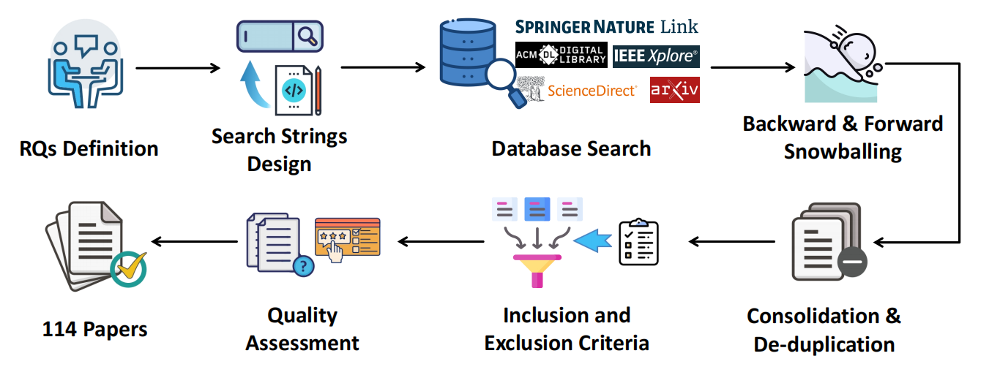
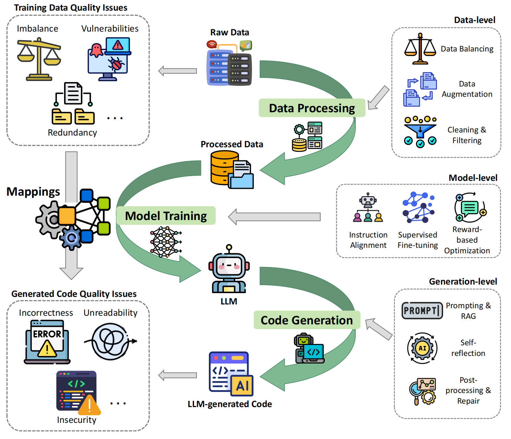
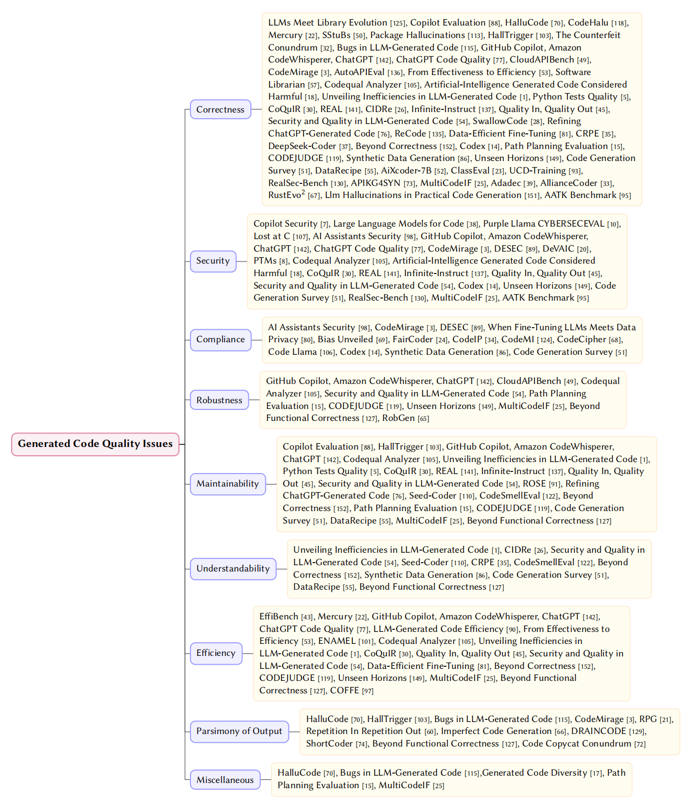
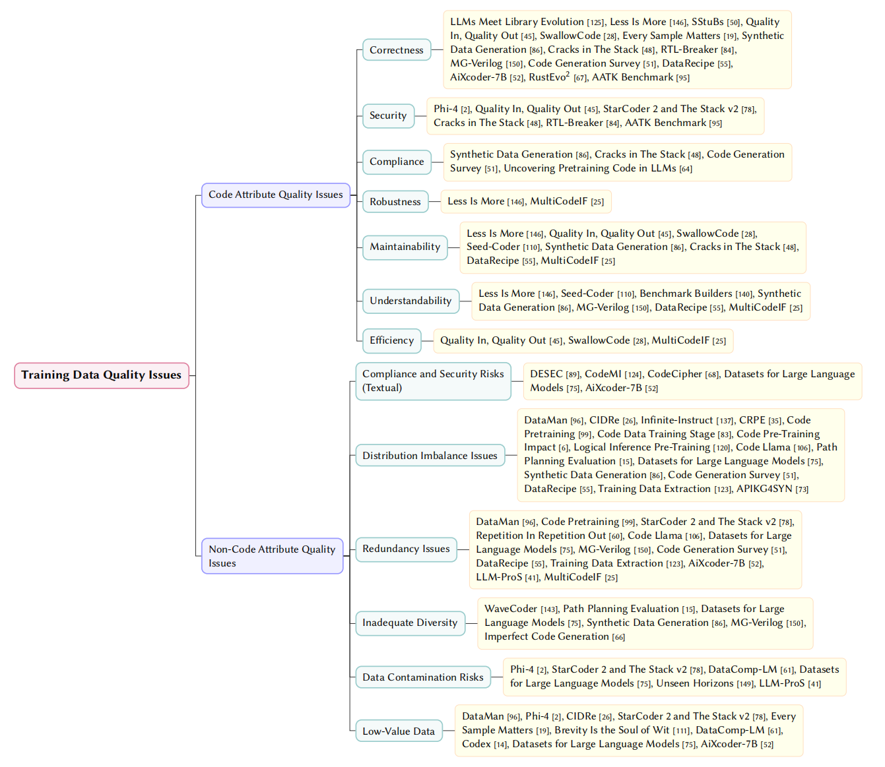
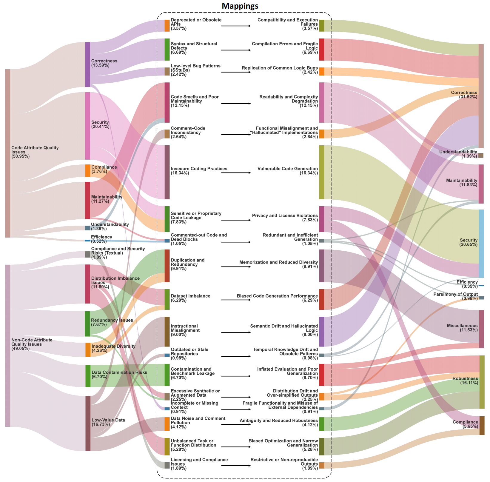
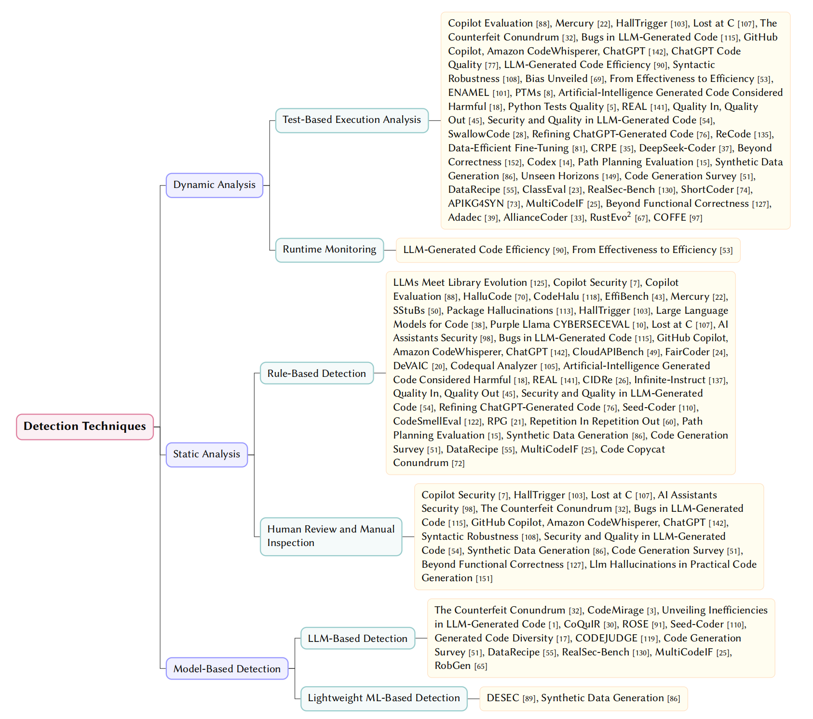
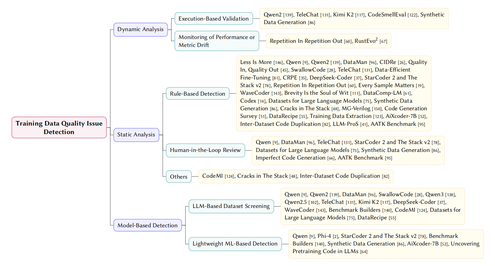
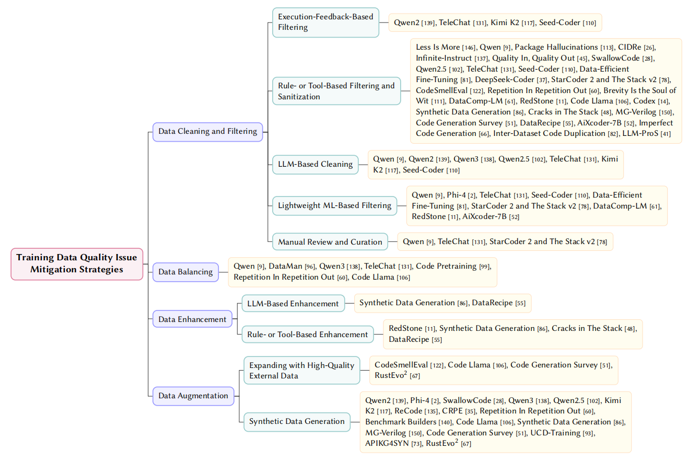

# Bridging Generation and Training: A Systematic Review of Quality Issues in LLMs for Code

  🌐 <a href="https://SYSUSELab.github.io/From-Data-to-Code"><strong>Documentation Website</strong></a> |
  📄 <a href="paper/From-Data-to-Code.pdf"><strong>Full Paper</strong></a>

## 📖 Abstract

Large language models (LLMs) frequently generate defective outputs in code generation tasks, ranging from logical bugs to security vulnerabilities. While these generation failures are often treated as model-level limitations, empirical evidence increasingly traces their root causes to imperfections within the training corpora. Yet, the specific mechanisms linking training data quality issues to generated code quality issues remain largely unmapped. This paper presents a systematic literature review of 114 primary studies to investigate how training data quality issues propagate into code generation. We establish a unified taxonomy that categorizes generated code quality issues across nine dimensions and training data quality issues into code and non-code attributes. Based on this taxonomy, we formalize a causal framework detailing 18 typical propagation mapping mechanisms. Furthermore, we synthesize state-of-the-art detection and mitigation techniques across the data, model, and generation lifecycles. The reviewed literature reveals a clear methodological shift: quality assurance is transitioning from reactive, heuristic-based post-generation filtering toward proactive, data-centric governance and closed-loop repair. Finally, we identify open challenges and outline research directions for developing reliable LLMs for code through integrated data curation and continuous evaluation. 

  
  
<em>Fig. 1. Overview of the paper collection and filtering process.</em>

  

  
  
<em>Fig. 2. Conceptual Framework of Quality Issues and Mitigation in the LLM Lifecycle.</em>

---

## 📢 News

- **[2026-04]** 🚀 Official documentation website is now live: [From-Data-to-Code Website](https://SYSUSELab.github.io/From-Data-to-Code)
- **[2026-04]** 🚀 The `From-Data-to-Code` repository is officially launched.

---

## 📑 Table of Contents

- [Bridging Generation and Training: A Systematic Review of Quality Issues in LLMs for Code](#bridging-generation-and-training-a-systematic-review-of-quality-issues-in-llms-for-code)
  - [📖 Abstract](#-abstract)
  - [📢 News](#-news)
  - [📑 Table of Contents](#-table-of-contents)
  - [📚 Findings](#-findings)
    - [💻 RQ1: Generated Code Quality Issues](#-rq1-generated-code-quality-issues)
    - [📊 RQ2: Training Data Quality Issues](#-rq2-training-data-quality-issues)
    - [🔗 RQ3: Mapping: Data to Code](#-rq3-mapping-data-to-code)
    - [🔍 RQ4: Detection Methods](#-rq4-detection-methods)
      - [1. Code-Level Detection](#1-code-level-detection)
      - [2. Data-Level Detection](#2-data-level-detection)
    - [🛠️ RQ5: Governance Strategies](#️-rq5-governance-strategies)
      - [1. Code-Level Mitigation](#1-code-level-mitigation)
      - [2. Data-Level Mitigation](#2-data-level-mitigation)
  - [🤝 Contribution](#-contribution)

---

## 📚 Findings

### 💻 RQ1: Generated Code Quality Issues

We discard vague concepts like generic "code hallucination" and establish a unified taxonomy encompassing **9 core dimensions** of quality issues in LLM-generated code:

1. **Correctness**: Functional accuracy and executability, categorized into syntax errors, logical flaws, and API misuse.
2. **Security**: Resilience against malicious exploitation, categorized into inherent design flaws and external vulnerabilities.
3. **Compliance**: Adherence to legal, ethical, and safety standards, categorized into copyright infringement, privacy leakage, and malicious code generation.
4. **Robustness**: Ability to handle abnormal inputs gracefully, manifesting as inadequate error handling and boundary condition failures.
5. **Maintainability**: Ease of long-term code modification, categorized into disorganized structure and low reusability.
6. **Understandability**: Human-readability and clarity, manifesting as poor naming conventions and lack of documentation.
7. **Efficiency**: Optimal system resource utilization, categorized into suboptimal time complexity and improper memory management.
8. **Parsimony of Output**: Conciseness of generated results, manifesting as redundant logic, useless loops, and extreme verbosity.
9. **Miscellaneous**: Anomalies outside the core eight dimensions, primarily manifesting as instruction-following failures.

 

  
  
<em>Fig. 3. Taxonomy of Generated Code Quality Issues</em>

**📄 Papers Referenced in this Section:**

1. **LLMs Meet Library Evolution**: LLMs Meet Library Evolution: Evaluating Deprecated API Usage in LLM-based Code Completion [Jun-24] [[paper](https://arxiv.org/abs/2406.09834)]
2. **Copilot Security**: Is GitHub’s Copilot as Bad as Humans at Introducing Vulnerabilities in Code? [Apr-22] [[paper](https://arxiv.org/abs/2204.04741)]
3. **Copilot Evaluation**: An Empirical Evaluation of GitHub Copilot’s Code Suggestions [Jan-25] [[paper](https://doi.org/10.1145/3524842.3528470)]
4. **HalluCode**: Exploring and Evaluating Hallucinations in LLM-Powered Code Generation [Apr-24] [[paper](https://arxiv.org/abs/2404.00971)]
5. **CodeHalu**: CodeHalu: Investigating Code Hallucinations in LLMs via Execution-based Verification [May-24] [[paper](https://arxiv.org/abs/2405.00253)]
6. **EffiBench**: EffiBench: Benchmarking the Efficiency of Automatically Generated Code [Feb-24] [[paper](https://arxiv.org/abs/2402.02037)]
7. **Mercury**: Mercury: A Code Efficiency Benchmark for Code Large Language Models [Feb-24] [[paper](https://arxiv.org/abs/2402.07844)]
8. **SStuBs**: Large Language Models and Simple, Stupid Bugs [Mar-23] [[paper](https://arxiv.org/abs/2303.11455)]
9. **package hallucinations**: We Have a Package for You! A Comprehensive Analysis of Package Hallucinations by Code Generating LLMs [Jun-24] [[paper](https://arxiv.org/abs/2406.10279)]
10. **HallTrigger**: Code Hallucination [Jul-24] [[paper](https://arxiv.org/abs/2407.04831)]
11. **Large Language Models for Code**: Large Language Models for Code: Security Hardening and Adversarial Testing [Feb-23] [[paper](https://arxiv.org/abs/2302.05319)]
12. **Purple Llama CYBERSECEVAL**: Purple Llama CYBERSECEVAL: A Secure Coding Benchmark for Language Models [Dec-23] [[paper](https://arxiv.org/abs/2312.04724)]
13. **Lost at C**: Lost at C: A User Study on the Security Implications of Large Language Model Code Assistants [Aug-22] [[paper](https://arxiv.org/abs/2208.09727)]
14. **AI Assistants Security**: Do Users Write More Insecure Code with AI Assistants? [Nov-22] [[paper](https://arxiv.org/abs/2211.03622)]
15. **The Counterfeit Conundrum**: The Counterfeit Conundrum: Can Code Language Models Grasp the Nuances of Their Incorrect Generations? [Feb-24] [[paper](https://arxiv.org/abs/2402.19475)]
16. **Bugs in LLM-generated Code**: Bugs in Large Language Models Generated Code: An Empirical Stud [Mar-24] [[paper](https://arxiv.org/abs/2403.08937)]
17. **GitHub Copilot, Amazon CodeWhisperer, ChatGPT**: Evaluating the Code Quality of AI-Assisted Code Generation Tools: An Empirical Study on GitHub Copilot, Amazon CodeWhisperer, and ChatGPT [Apr-23] [[paper](https://arxiv.org/abs/2304.10778)]
18. **ChatGPT Code Quality**: No Need to Lift a Finger Anymore? Assessing the Quality of Code Generation by ChatGPT [Aug-23] [[paper](https://arxiv.org/abs/2308.04838)]
19. **CloudAPIBench**: On Mitigating Code LLM Hallucinations with API Documentation [Jul-24] [[paper](https://arxiv.org/abs/2407.09726)]
20. **CodeMirage**: CodeMirage: Hallucinations in Code Generated by Large Language Models [Aug-24] [[paper](https://arxiv.org/abs/2408.08333)]
21. **LLM-generated Code Efficiency**: On Evaluating the Efficiency of Source Code Generated by LLMs [Apr-24] [[paper](https://arxiv.org/abs/2404.06041)]
22. **AutoAPIEval**: A Comprehensive Framework for Evaluating API-oriented Code Generation in Large Language Models [Sep-24] [[paper](https://arxiv.org/abs/2409.15228)]
23. **DeSec**: Decoding Secret Memorization in Code LLMs Through Token-Level Characterization [Oct-24] [[paper](https://arxiv.org/abs/2410.08858)]
24. **When Fine-Tuning LLMs Meets Data Privacy**: When Fine-Tuning LLMs Meets Data Privacy: An Empirical Study of Federated Learning in LLM-Based Program Repair [Dec-24] [[paper](https://arxiv.org/abs/2412.01072)]
25. **Bias Unveiled**: Bias Unveiled: Investigating Social Bias in LLM-Generated Code [Nov-24] [[paper](https://arxiv.org/abs/2411.10351)]
26. **FairCoder**: FairCoder: Evaluating Social Bias of LLMs in Code Generation [Jan-25] [[paper](https://arxiv.org/abs/2501.05396)]
27. **CodeIP**: CodeIP: A Grammar-Guided Multi-Bit Watermark for Large Language Models of Code [Apr-24] [[paper](https://arxiv.org/abs/2404.15639)]
28. **From Effectiveness to Efficiency**: From Effectiveness to Efficiency: Comparative Evaluation of Code Generated by LCGMs for Bilingual Programming Questions [Jun-24] [[paper](https://arxiv.org/abs/2406.00602)]
29. **ENAMEL**: How Efficient is LLM-Generated Code? A Rigorous & High-Standard Benchmark [Jun-24] [[paper](https://arxiv.org/abs/2406.06647)]
30. **DeVAIC**: DeVAIC: A Tool for Security Assessment of AI-generated Code [Apr-24] [[paper](https://arxiv.org/abs/2404.07548)]
31. **PTMs**: Comparing Robustness Against Adversarial Attacks in Code Generation: LLM-Generated vs. Human-Written [Nov-24] [[paper](https://arxiv.org/abs/2411.10565)]
32. **Software Librarian**: Is ChatGPT a Good Software Librarian? An Exploratory Study on the Use of ChatGPT for Software Library Recommendations [Aug-24] [[paper](https://arxiv.org/abs/2408.05128)]
33. **Codequal Analyzer**: Improving LLM-Generated Code Quality with GRPO [Jun-25] [[paper](https://arxiv.org/abs/2506.02211)]
34. **Artificial-Intelligence Generated Code Considered Harmful**: Artificial-Intelligence Generated Code Considered Harmful: A Road Map for Secure and High-Quality Code Generation [Sep-24] [[paper](https://arxiv.org/abs/2409.19182)]
35. **Unveiling Inefficiencies in LLM-Generated Code**: Unveiling Inefficiencies in LLM-Generated Code: Toward a Comprehensive Taxonomy [Mar-25] [[paper](https://arxiv.org/abs/2503.06327)]
36. **Python Tests Quality**: Quality Assessment of Python Tests Generated by Large Language Models [Jun-25] [[paper](https://arxiv.org/abs/2506.14297)]
37. **CoQuIR**: CoQuIR: A Comprehensive Benchmark for Code Quality-Aware Information Retrieval [Jun-25] [[paper](https://arxiv.org/abs/2506.11066)]
38. **REAL**: Training Language Models to Generate Quality Code with Program Analysis Feedback [May-25] [[paper](https://arxiv.org/abs/2505.22704)]
39. **CIDRe**: CIDRe: A Reference-Free Multi-Aspect Criterion for Code Comment Quality Measurement [May-25] [[paper](https://arxiv.org/abs/2505.19757)]
40. **Infinite-Instruct**: Infinite-Instruct: Synthesizing Scaling Code instruction Data with Bidirectional Synthesis and Static Verification [May-25] [[paper](https://arxiv.org/abs/2505.23177)]
41. **Quality In, Quality Out**: Quality In, Quality Out: Investigating Training Data's Role in AI Code Generation [Mar-25] [[paper](https://arxiv.org/abs/2503.11402)]
42. **Security and Quality in LLM-Generated Code**: Security and Quality in LLM-Generated Code: A Multi-Language, Multi-Model Analysis [Feb-25] [[paper](https://arxiv.org/abs/2502.01853)]
43. **SwallowCode**: Rewriting Pre-Training Data Boosts LLM Performance in Math and Code [May-25] [[paper](https://arxiv.org/abs/2505.02881)]
44. **ROSE**: ROSE: Transformer-Based Refactoring Recommendation for Architectural Smells [Jul-25] [[paper](https://arxiv.org/abs/2507.12561)]
45. **Refining ChatGPT-Generated Code**: Refining ChatGPT-Generated Code: Characterizing and Mitigating Code Quality Issues [Jul-23] [[paper](https://arxiv.org/abs/2307.12596)]
46. **ReCode**: ReCode: Updating Code API Knowledge with Reinforcement Learning [Jun-25] [[paper](https://arxiv.org/abs/2506.20495)]
47. **Seed-Coder**: Seed-Coder: Let the Code Model Curate Data for Itself [Jun-25] [[paper](https://arxiv.org/abs/2506.03524)]
48. **Data-efficient Fine-tuning**: Data-efficient LLM Fine-tuning for Code Generation [Apr-25] [[paper](https://arxiv.org/abs/2504.12687)]
49. **CRPE**: CRPE: Expanding The Reasoning Capability of Large Language Model for Code Generation [May-25] [[paper](https://arxiv.org/abs/2505.10594)]
50. **DeepSeek-Coder**: DeepSeek-Coder: When the Large Language Model Meets Programming -- The Rise of Code Intelligence [Jan-24] [[paper](https://arxiv.org/abs/2401.14196)]
51. **CodeSmellEval**: How Propense Are Large Language Models at Producing Code Smells? A Benchmarking Study [Dec-24] [[paper](https://arxiv.org/abs/2412.18989)]
52. **RPG**: Rethinking Repetition Problems of LLMs in Code Generation [May-25] [[paper](https://arxiv.org/abs/2505.10402)]
53. **Repetition In Repetition Out**: Repetition In Repetition Out: Towards Understanding Neural Text Degeneration from the Data Perspective [Oct-23] [[paper](https://arxiv.org/abs/2310.10226)]
54. **Beyond Correctness**: Beyond Correctness: Benchmarking Multi-dimensional Code Generation for Large Language Models [Jul-24] [[paper](https://arxiv.org/abs/2407.11470)]
55. **Generated Code Diversity**: Is Functional Correctness Enough to Evaluate Code Language Models? Exploring Diversity of Generated Codes [Aug-24] [[paper](https://arxiv.org/abs/2408.14504)]
56. **CodeMI**: Does Your Neural Code Completion Model Use My Code? A Membership Inference Approach [Apr-24] [[paper](https://arxiv.org/abs/2404.14296)]
57. **CodeCipher**: CodeCipher: Learning to Obfuscate Source Code Against LLMs [Oct-24] [[paper](https://arxiv.org/abs/2410.05797)]
58. **Code Llama**: Code Llama: Open Foundation Models for Code [Aug-23] [[paper](https://arxiv.org/abs/2308.12950)]
59. **Codex**: Evaluating Large Language Models Trained on Code [Jul-21] [[paper](https://arxiv.org/abs/2107.03374)]
60. **Path Planning Evaluation**: Assessing LLM code generation quality through path planning tasks [Apr-25] [[paper](https://arxiv.org/abs/2504.21276)]
61. **CODEJUDGE**: CODEJUDGE : Evaluating Code Generation with Large Language Models [Jan-24] [[paper](https://aclanthology.org/2024.emnlp-main.1118.pdf?utm_source=chatgpt.com)]
62. **Synthetic Data Generation**: Synthetic Data Generation Using Large Language Models: Advances in Text and Code [Jan-25] [[paper](https://ieeexplore.ieee.org/document/11080380)]
63. **Unseen Horizons**: Unseen Horizons: Unveiling the Real Capability of LLM Code Generation Beyond the Familiar [Apr-25] [[paper](https://ieeexplore.ieee.org/document/11029836)]
64. **Code Generation Survey**: A Survey on Large Language Models for Code Generation [Aug-24] [[paper](https://dl.acm.org/doi/10.1145/3747588)]
65. **DataRecipe**: DataRecipe --- How to Cook the Data for CodeLLM? [Oct-24] [[paper](https://dl.acm.org/doi/10.1145/3691620.3695593)]
66. **aiXcoder-7B**: aiXcoder-7B: A Lightweight and Effective Large Language Model for Code Processing [Apr-25] [[paper](https://ieeexplore.ieee.org/document/11121702)]
67. **Imperfect Code Generation**: Imperfect Code Generation: Uncovering Weaknesses in Automatic Code Generation by Large Language Models [May-24] [[paper](https://ieeexplore.ieee.org/document/10554837)]
68. **ClassEval**: Evaluating Large Language Models in Class-Level Code Generation [Jun-24] [[paper](https://ieeexplore.ieee.org/document/10549472)]
69. **UCD-Training**: Unseen-Codebases-Domain Data Synthesis and Training Based on Code Graphs [Feb-26] [[paper](https://arxiv.org/abs/2602.20799)]
70. **DRAINCODE**: DRAINCODE: Stealthy Energy Consumption Attacks on Retrieval-Augmented Code Generation via Context PoisoningPreprint [Jan-26] [[paper](https://arxiv.org/abs/2601.20615)]
71. **RealSec-Bench**: RealSec-bench: A Benchmark for Evaluating Secure Code Generation in Real-World Repositories [Jan-26] [[paper](https://arxiv.org/abs/2601.22706)]
72. **ShortCoder**: ShortCoder: Knowledge-Augmented Syntax Optimization for Token-Efficient Code GenerationPreprint [Jan-26] [[paper](https://arxiv.org/abs/2601.09703)]
73. **APIKG4SYN**: Framework-Aware Code Generation with API Knowledge Graph-Constructed Data: A Study on HarmonyOS [Nov-25] [[paper](https://arxiv.org/abs/2512.00380)]
74. **MultiCodeIF**: A hierarchical and evolvable benchmark for fine-grained code instruction following with multi-turn feedback [Jul-25] [[paper](https://arxiv.org/abs/2507.00699)]
75. **Beyond Functional Correctness**: Beyond functional correctness: Investigating coding style inconsistencies in large language models [Jun-24] [[paper](https://arxiv.org/abs/2407.00456)]
76. **Adadec**: Adadec: Uncertainty-guided adaptive decoding for llm-based code generation [Jun-25] [[paper](https://arxiv.org/html/2506.08980v1)]
77. **Code Copycat Conundrum**: Code Copycat Conundrum: Demystifying Repetition in LLM-based Code Generation [Apr-25] [[paper](https://arxiv.org/abs/2504.12608)]
78. **AllianceCoder**: What to retrieve for effective retrieval-augmented code generation? an empirical study and beyond [Mar-25] [[paper](https://arxiv.org/abs/2503.20589)]
79. **RustEvo^ 2**: RustEvo^ 2: An Evolving Benchmark for API Evolution in LLM-based Rust Code Generation [Mar-25] [[paper](https://arxiv.org/abs/2503.16922)]
80. **RobGen**: A Preliminary Study on the Robustness of Code Generation by Large Language Models [Mar-25] [[paper](https://arxiv.org/abs/2503.20197)]
81. **Llm Hallucinations in Practical Code Generation**: Llm hallucinations in practical code generation: Phenomena, mechanism, and mitigation [Sep-24] [[paper](https://arxiv.org/abs/2409.20550)]
82. **COFFE**: COFFE: A Code Efficiency Benchmark for Code Generation [Feb-25] [[paper](https://arxiv.org/abs/2502.02827)]
83. **AATK Benchmark**: Asleep at the keyboard? assessing the security of github copilot's code contributions [Aug-21] [[paper](https://dl.acm.org/doi/10.1145/3610721)]

### 📊 RQ2: Training Data Quality Issues

We categorize intrinsic flaws within pre-training and fine-tuning corpora into **two core dimensions**:

1. **Code Attribute Quality Issues**: Inherent defects within individual code samples that models explicitly learn, categorized into correctness, security, compliance, robustness, maintainability, understandability, and efficiency flaws.
2. **Non-Code Attribute Quality Issues**: Non-code textual noise and macro-level dataset flaws. Categorized into:
   - **Compliance and Security Risks (Textual)**: Hazards inherent in textual data, categorized into illegal/harmful, copyright-infringing, and privacy-leaking text.
   - **Distribution Imbalance Issues**: Skewed dataset proportions, manifesting as imbalances across programming languages, domains, data types, or difficulty levels.
   - **Redundancy Issues**: Excessive repetition, manifesting as duplicate samples or synthetic data degradation.
   - **Inadequate Diversity**: Insufficient coverage of real-world scenarios, manifesting as underrepresented edge cases or niche business logic.
   - **Data Contamination Risks**: Leakage of evaluation data, primarily manifesting as benchmark test sets embedded in training corpora.
   - **Low-Value Data**: Data contributing little or negatively to learning, categorized into meaningless text, format noise, low-information-density text, erroneous text, and incomplete data.

 

  
  
<em>Fig. 4. Taxonomy of Training Data Quality Issues</em>

**📄 Papers Referenced in this Section:**

1. **LLMs Meet Library Evolution**: LLMs Meet Library Evolution: Evaluating Deprecated API Usage in LLM-based Code Completion [Jun-24] [[paper](https://arxiv.org/abs/2406.09834)]
2. **Less is More**: Less is More: On the Importance of Data Quality for Unit Test Generation [Feb-25] [[paper](https://arxiv.org/abs/2502.14212)]
3. **DataMan**: DataMan: Data Manager for Pre-training Large Language Models [Feb-25] [[paper](https://arxiv.org/abs/2502.19363)]
4. **Phi-4**: Phi-4 Technical Report [Dec-24] [[paper](https://arxiv.org/abs/2412.08905)]
5. **SStuBs**: Large Language Models and Simple, Stupid Bugs [Mar-23] [[paper](https://arxiv.org/abs/2303.11455)]
6. **DeSec**: Decoding Secret Memorization in Code LLMs Through Token-Level Characterization [Oct-24] [[paper](https://arxiv.org/abs/2410.08858)]
7. **CIDRe**: CIDRe: A Reference-Free Multi-Aspect Criterion for Code Comment Quality Measurement [May-25] [[paper](https://arxiv.org/abs/2505.19757)]
8. **Infinite-Instruct**: Infinite-Instruct: Synthesizing Scaling Code instruction Data with Bidirectional Synthesis and Static Verification [May-25] [[paper](https://arxiv.org/abs/2505.23177)]
9. **Quality In, Quality Out**: Quality In, Quality Out: Investigating Training Data's Role in AI Code Generation [Mar-25] [[paper](https://arxiv.org/abs/2503.11402)]
10. **SwallowCode**: Rewriting Pre-Training Data Boosts LLM Performance in Math and Code [May-25] [[paper](https://arxiv.org/abs/2505.02881)]
11. **Seed-Coder**: Seed-Coder: Let the Code Model Curate Data for Itself [Jun-25] [[paper](https://arxiv.org/abs/2506.03524)]
12. **CRPE**: CRPE: Expanding The Reasoning Capability of Large Language Model for Code Generation [May-25] [[paper](https://arxiv.org/abs/2505.10594)]
13. **GPT-4**: GPT-4 Technical Report [Mar-23] [[paper](https://arxiv.org/abs/2303.08774)]
14. **Code Pretraining**: How Does Code Pretraining Affect Language Model Task Performance? [Sep-24] [[paper](https://arxiv.org/abs/2409.04556)]
15. **StarCoder 2 and The Stack v2**: StarCoder 2 and The Stack v2: The Next Generation [Feb-24] [[paper](https://arxiv.org/abs/2402.19173)]
16. **Repetition In Repetition Out**: Repetition In Repetition Out: Towards Understanding Neural Text Degeneration from the Data Perspective [Oct-23] [[paper](https://arxiv.org/abs/2310.10226)]
17. **Every Sample Matters**: Every Sample Matters: Leveraging Mixture-of-Experts and High-Quality Data for Efficient and Accurate Code LLM [Mar-25] [[paper](https://arxiv.org/abs/2503.17793)]
18. **Code Data Training Stage**: At Which Training Stage Does Code Data Help LLMs Reasoning? [Sep-23] [[paper](https://arxiv.org/abs/2309.16298)]
19. **WaveCoder**: WaveCoder: Widespread And Versatile Enhancement For Code Large Language Models By Instruction Tuning [Dec-23] [[paper](https://arxiv.org/abs/2312.14187)]
20. **Brevity is the soul of wit**: Brevity is the soul of wit: Pruning long files for code generation [Jul-24] [[paper](https://arxiv.org/abs/2407.00434)]
21. **Benchmark Builders**: Large Language Models are Qualified Benchmark Builders: Rebuilding Pre-Training Datasets for Advancing Code Intelligence Tasks [Apr-25] [[paper](https://arxiv.org/abs/2504.19444)]
22. **CodeMI**: Does Your Neural Code Completion Model Use My Code? A Membership Inference Approach [Apr-24] [[paper](https://arxiv.org/abs/2404.14296)]
23. **CodeCipher**: CodeCipher: Learning to Obfuscate Source Code Against LLMs [Oct-24] [[paper](https://arxiv.org/abs/2410.05797)]
24. **Code Pre-training Impact**: To Code, or Not To Code? Exploring Impact of Code in Pre-training [Aug-24] [[paper](https://arxiv.org/abs/2408.10914)]
25. **DataComp-LM**: DataComp-LM: In search of the next generation of training sets for language models [Jun-24] [[paper](https://arxiv.org/abs/2406.11794)]
26. **Logical Inference Pre-training**: Which Programming Language and What Features at Pre-training Stage Affect Downstream Logical Inference Performance? [Oct-24] [[paper](https://arxiv.org/abs/2410.06735)]
27. **Code Llama**: Code Llama: Open Foundation Models for Code [Aug-23] [[paper](https://arxiv.org/abs/2308.12950)]
28. **Codex**: Evaluating Large Language Models Trained on Code [Jul-21] [[paper](https://arxiv.org/abs/2107.03374)]
29. **Path Planning Evaluation**: Assessing LLM code generation quality through path planning tasks [Apr-25] [[paper](https://arxiv.org/abs/2504.21276)]
30. **Datasets for Large Language Models**: Datasets for Large Language Models: A Comprehensive Survey [Feb-24] [[paper](https://arxiv.org/abs/2402.18041)]
31. **Synthetic Data Generation**: Synthetic Data Generation Using Large Language Models: Advances in Text and Code [Jan-25] [[paper](https://ieeexplore.ieee.org/document/11080380)]
32. **Cracks in The Stack**: Cracks in The Stack: Hidden Vulnerabilities and Licensing Risks in LLM Pre-Training Datasets [May-25] [[paper](https://ieeexplore.ieee.org/document/11028470)]
33. **Unseen Horizons**: Unseen Horizons: Unveiling the Real Capability of LLM Code Generation Beyond the Familiar [Apr-25] [[paper](https://ieeexplore.ieee.org/document/11029836)]
34. **RTL-Breaker**: RTL-Breaker: Assessing the Security of LLMs Against Backdoor Attacks on HDL Code Generation [Mar-25] [[paper](https://ieeexplore.ieee.org/document/10993260)]
35. **MG-Verilog**: MG-Verilog: Multi-grained Dataset Towards Enhanced LLM-assisted Verilog Generation [Jun-24] [[paper](https://ieeexplore.ieee.org/document/10691738)]
36. **Code Generation Survey**: A Survey on Large Language Models for Code Generation [Aug-24] [[paper](https://dl.acm.org/doi/10.1145/3747588)]
37. **DataRecipe**: DataRecipe --- How to Cook the Data for CodeLLM? [Oct-24] [[paper](https://dl.acm.org/doi/10.1145/3691620.3695593)]
38. **Training Data Extraction**: Understanding Privacy Risks of Large Language Models in Japanese Based on Training Data Extraction Attacks [Aug-25] [[paper](https://dl.acm.org/doi/10.1145/3709018.3736331)]
39. **aiXcoder-7B**: aiXcoder-7B: A Lightweight and Effective Large Language Model for Code Processing [Apr-25] [[paper](https://ieeexplore.ieee.org/document/11121702)]
40. **Imperfect Code Generation**: Imperfect Code Generation: Uncovering Weaknesses in Automatic Code Generation by Large Language Models [May-24] [[paper](https://ieeexplore.ieee.org/document/10554837)]
41. **LLM-ProS**: LLM-ProS: Analyzing Large Language Models’ Performance in Competitive Problem Solving [May-25] [[paper](https://ieeexplore.ieee.org/document/11028406)]
42. **Uncovering Pretraining Code in LLMs**: Uncovering Pretraining Code in LLMs: A Syntax-Aware Attribution Approach [Nov-25] [[paper](https://arxiv.org/abs/2511.07033)]
43. **APIKG4SYN**: Framework-Aware Code Generation with API Knowledge Graph-Constructed Data: A Study on HarmonyOS [Nov-25] [[paper](https://arxiv.org/abs/2512.00380)]
44. **MultiCodeIF**: A hierarchical and evolvable benchmark for fine-grained code instruction following with multi-turn feedback [Jul-25] [[paper](https://arxiv.org/abs/2507.00699)]
45. **RustEvo^ 2**: RustEvo^ 2: An Evolving Benchmark for API Evolution in LLM-based Rust Code Generation [Mar-25] [[paper](https://arxiv.org/abs/2503.16922)]
46. **AATK Benchmark**: Asleep at the keyboard? assessing the security of github copilot's code contributions [Aug-21] [[paper](https://dl.acm.org/doi/10.1145/3610721)]

### 🔗 RQ3: Mapping: Data to Code

How do data defects cause code generation failures? We summarize **18 propagation mechanisms** bridging the gap between dataset flaws and generated code defects:

1. **Direct Mappings (10 types)**: The classic "garbage in, garbage out" replication. The model explicitly memorizes dataset flaws and replicates them.
2. **Indirect Mappings (8 types)**: Insidious propagation. Non-code defects do not inject explicit errors but disrupt the model's internal representations via mechanisms such as _entropy collapse_, _representation bias_, or _semantic drift_.

 

  
  
<em>Fig. 5. Mapping mechanisms from Training Data Issues to Generated Code Issues.</em>

**📄 Papers Referenced in this Section:**

1. **LLMs Meet Library Evolution**: LLMs Meet Library Evolution: Evaluating Deprecated API Usage in LLM-based Code Completion [Jun-24] [[paper](https://arxiv.org/abs/2406.09834)]
2. **Less is More**: Less is More: On the Importance of Data Quality for Unit Test Generation [Feb-25] [[paper](https://arxiv.org/abs/2502.14212)]
3. **Qwen**: Qwen Technical Report [Sep-23] [[paper](https://arxiv.org/abs/2309.16609)]
4. **DataMan**: DataMan: Data Manager for Pre-training Large Language Models [Feb-25] [[paper](https://arxiv.org/abs/2502.19363)]
5. **Phi-4**: Phi-4 Technical Report [Dec-24] [[paper](https://arxiv.org/abs/2412.08905)]
6. **Copilot Security**: Is GitHub’s Copilot as Bad as Humans at Introducing Vulnerabilities in Code? [Apr-22] [[paper](https://arxiv.org/abs/2204.04741)]
7. **Copilot Evaluation**: An Empirical Evaluation of GitHub Copilot’s Code Suggestions [Jan-25] [[paper](https://doi.org/10.1145/3524842.3528470)]
8. **HalluCode**: Exploring and Evaluating Hallucinations in LLM-Powered Code Generation [Apr-24] [[paper](https://arxiv.org/abs/2404.00971)]
9. **CodeHalu**: CodeHalu: Investigating Code Hallucinations in LLMs via Execution-based Verification [May-24] [[paper](https://arxiv.org/abs/2405.00253)]
10. **SStuBs**: Large Language Models and Simple, Stupid Bugs [Mar-23] [[paper](https://arxiv.org/abs/2303.11455)]
11. **package hallucinations**: We Have a Package for You! A Comprehensive Analysis of Package Hallucinations by Code Generating LLMs [Jun-24] [[paper](https://arxiv.org/abs/2406.10279)]
12. **HallTrigger**: Code Hallucination [Jul-24] [[paper](https://arxiv.org/abs/2407.04831)]
13. **Large Language Models for Code**: Large Language Models for Code: Security Hardening and Adversarial Testing [Feb-23] [[paper](https://arxiv.org/abs/2302.05319)]
14. **Purple Llama CYBERSECEVAL**: Purple Llama CYBERSECEVAL: A Secure Coding Benchmark for Language Models [Dec-23] [[paper](https://arxiv.org/abs/2312.04724)]
15. **Lost at C**: Lost at C: A User Study on the Security Implications of Large Language Model Code Assistants [Aug-22] [[paper](https://arxiv.org/abs/2208.09727)]
16. **AI Assistants Security**: Do Users Write More Insecure Code with AI Assistants? [Nov-22] [[paper](https://arxiv.org/abs/2211.03622)]
17. **Bugs in LLM-generated Code**: Bugs in Large Language Models Generated Code: An Empirical Stud [Mar-24] [[paper](https://arxiv.org/abs/2403.08937)]
18. **GitHub Copilot, Amazon CodeWhisperer, ChatGPT**: Evaluating the Code Quality of AI-Assisted Code Generation Tools: An Empirical Study on GitHub Copilot, Amazon CodeWhisperer, and ChatGPT [Apr-23] [[paper](https://arxiv.org/abs/2304.10778)]
19. **ChatGPT Code Quality**: No Need to Lift a Finger Anymore? Assessing the Quality of Code Generation by ChatGPT [Aug-23] [[paper](https://arxiv.org/abs/2308.04838)]
20. **CloudAPIBench**: On Mitigating Code LLM Hallucinations with API Documentation [Jul-24] [[paper](https://arxiv.org/abs/2407.09726)]
21. **CodeMirage**: CodeMirage: Hallucinations in Code Generated by Large Language Models [Aug-24] [[paper](https://arxiv.org/abs/2408.08333)]
22. **Syntactic Robustness**: Syntactic Robustness for LLM-based Code Generation [Apr-24] [[paper](https://arxiv.org/abs/2404.01535)]
23. **NLPerturbator**: NLPerturbator: Studying the Robustness of Code LLMs to Natural Language Variations [Jun-24] [[paper](https://arxiv.org/abs/2406.19783)]
24. **AutoAPIEval**: A Comprehensive Framework for Evaluating API-oriented Code Generation in Large Language Models [Sep-24] [[paper](https://arxiv.org/abs/2409.15228)]
25. **DeSec**: Decoding Secret Memorization in Code LLMs Through Token-Level Characterization [Oct-24] [[paper](https://arxiv.org/abs/2410.08858)]
26. **When Fine-Tuning LLMs Meets Data Privacy**: When Fine-Tuning LLMs Meets Data Privacy: An Empirical Study of Federated Learning in LLM-Based Program Repair [Dec-24] [[paper](https://arxiv.org/abs/2412.01072)]
27. **Bias Unveiled**: Bias Unveiled: Investigating Social Bias in LLM-Generated Code [Nov-24] [[paper](https://arxiv.org/abs/2411.10351)]
28. **FairCoder**: FairCoder: Evaluating Social Bias of LLMs in Code Generation [Jan-25] [[paper](https://arxiv.org/abs/2501.05396)]
29. **CodeIP**: CodeIP: A Grammar-Guided Multi-Bit Watermark for Large Language Models of Code [Apr-24] [[paper](https://arxiv.org/abs/2404.15639)]
30. **DeVAIC**: DeVAIC: A Tool for Security Assessment of AI-generated Code [Apr-24] [[paper](https://arxiv.org/abs/2404.07548)]
31. **Software Librarian**: Is ChatGPT a Good Software Librarian? An Exploratory Study on the Use of ChatGPT for Software Library Recommendations [Aug-24] [[paper](https://arxiv.org/abs/2408.05128)]
32. **Codequal Analyzer**: Improving LLM-Generated Code Quality with GRPO [Jun-25] [[paper](https://arxiv.org/abs/2506.02211)]
33. **Artificial-Intelligence Generated Code Considered Harmful**: Artificial-Intelligence Generated Code Considered Harmful: A Road Map for Secure and High-Quality Code Generation [Sep-24] [[paper](https://arxiv.org/abs/2409.19182)]
34. **Unveiling Inefficiencies in LLM-Generated Code**: Unveiling Inefficiencies in LLM-Generated Code: Toward a Comprehensive Taxonomy [Mar-25] [[paper](https://arxiv.org/abs/2503.06327)]
35. **Python Tests Quality**: Quality Assessment of Python Tests Generated by Large Language Models [Jun-25] [[paper](https://arxiv.org/abs/2506.14297)]
36. **CoQuIR**: CoQuIR: A Comprehensive Benchmark for Code Quality-Aware Information Retrieval [Jun-25] [[paper](https://arxiv.org/abs/2506.11066)]
37. **REAL**: Training Language Models to Generate Quality Code with Program Analysis Feedback [May-25] [[paper](https://arxiv.org/abs/2505.22704)]
38. **CIDRe**: CIDRe: A Reference-Free Multi-Aspect Criterion for Code Comment Quality Measurement [May-25] [[paper](https://arxiv.org/abs/2505.19757)]
39. **Infinite-Instruct**: Infinite-Instruct: Synthesizing Scaling Code instruction Data with Bidirectional Synthesis and Static Verification [May-25] [[paper](https://arxiv.org/abs/2505.23177)]
40. **Quality In, Quality Out**: Quality In, Quality Out: Investigating Training Data's Role in AI Code Generation [Mar-25] [[paper](https://arxiv.org/abs/2503.11402)]
41. **Security and Quality in LLM-Generated Code**: Security and Quality in LLM-Generated Code: A Multi-Language, Multi-Model Analysis [Feb-25] [[paper](https://arxiv.org/abs/2502.01853)]
42. **SwallowCode**: Rewriting Pre-Training Data Boosts LLM Performance in Math and Code [May-25] [[paper](https://arxiv.org/abs/2505.02881)]
43. **ROSE**: ROSE: Transformer-Based Refactoring Recommendation for Architectural Smells [Jul-25] [[paper](https://arxiv.org/abs/2507.12561)]
44. **Refining ChatGPT-Generated Code**: Refining ChatGPT-Generated Code: Characterizing and Mitigating Code Quality Issues [Jul-23] [[paper](https://arxiv.org/abs/2307.12596)]
45. **Qwen2.5**: Qwen2.5 Technical Report [Dec-24] [[paper](https://arxiv.org/abs/2412.15115)]
46. **ReCode**: ReCode: Updating Code API Knowledge with Reinforcement Learning [Jun-25] [[paper](https://arxiv.org/abs/2506.20495)]
47. **Data-efficient Fine-tuning**: Data-efficient LLM Fine-tuning for Code Generation [Apr-25] [[paper](https://arxiv.org/abs/2504.12687)]
48. **CRPE**: CRPE: Expanding The Reasoning Capability of Large Language Model for Code Generation [May-25] [[paper](https://arxiv.org/abs/2505.10594)]
49. **DeepSeek-Coder**: DeepSeek-Coder: When the Large Language Model Meets Programming -- The Rise of Code Intelligence [Jan-24] [[paper](https://arxiv.org/abs/2401.14196)]
50. **GPT-4**: GPT-4 Technical Report [Mar-23] [[paper](https://arxiv.org/abs/2303.08774)]
51. **Code Pretraining**: How Does Code Pretraining Affect Language Model Task Performance? [Sep-24] [[paper](https://arxiv.org/abs/2409.04556)]
52. **StarCoder 2 and The Stack v2**: StarCoder 2 and The Stack v2: The Next Generation [Feb-24] [[paper](https://arxiv.org/abs/2402.19173)]
53. **CodeSmellEval**: How Propense Are Large Language Models at Producing Code Smells? A Benchmarking Study [Dec-24] [[paper](https://arxiv.org/abs/2412.18989)]
54. **RPG**: Rethinking Repetition Problems of LLMs in Code Generation [May-25] [[paper](https://arxiv.org/abs/2505.10402)]
55. **Repetition In Repetition Out**: Repetition In Repetition Out: Towards Understanding Neural Text Degeneration from the Data Perspective [Oct-23] [[paper](https://arxiv.org/abs/2310.10226)]
56. **Code Data Training Stage**: At Which Training Stage Does Code Data Help LLMs Reasoning? [Sep-23] [[paper](https://arxiv.org/abs/2309.16298)]
57. **Brevity is the soul of wit**: Brevity is the soul of wit: Pruning long files for code generation [Jul-24] [[paper](https://arxiv.org/abs/2407.00434)]
58. **Benchmark Builders**: Large Language Models are Qualified Benchmark Builders: Rebuilding Pre-Training Datasets for Advancing Code Intelligence Tasks [Apr-25] [[paper](https://arxiv.org/abs/2504.19444)]
59. **Generated Code Diversity**: Is Functional Correctness Enough to Evaluate Code Language Models? Exploring Diversity of Generated Codes [Aug-24] [[paper](https://arxiv.org/abs/2408.14504)]
60. **CodeMI**: Does Your Neural Code Completion Model Use My Code? A Membership Inference Approach [Apr-24] [[paper](https://arxiv.org/abs/2404.14296)]
61. **CodeCipher**: CodeCipher: Learning to Obfuscate Source Code Against LLMs [Oct-24] [[paper](https://arxiv.org/abs/2410.05797)]
62. **Code Pre-training Impact**: To Code, or Not To Code? Exploring Impact of Code in Pre-training [Aug-24] [[paper](https://arxiv.org/abs/2408.10914)]
63. **DataComp-LM**: DataComp-LM: In search of the next generation of training sets for language models [Jun-24] [[paper](https://arxiv.org/abs/2406.11794)]
64. **RedStone**: RedStone: Curating General, Code, Math, and QA Data for Large Language Models [Dec-24] [[paper](https://arxiv.org/abs/2412.03398)]
65. **Code Llama**: Code Llama: Open Foundation Models for Code [Aug-23] [[paper](https://arxiv.org/abs/2308.12950)]
66. **Codex**: Evaluating Large Language Models Trained on Code [Jul-21] [[paper](https://arxiv.org/abs/2107.03374)]
67. **Path Planning Evaluation**: Assessing LLM code generation quality through path planning tasks [Apr-25] [[paper](https://arxiv.org/abs/2504.21276)]
68. **CODEJUDGE**: CODEJUDGE : Evaluating Code Generation with Large Language Models [Jan-24] [[paper](https://aclanthology.org/2024.emnlp-main.1118.pdf?utm_source=chatgpt.com)]
69. **Datasets for Large Language Models**: Datasets for Large Language Models: A Comprehensive Survey [Feb-24] [[paper](https://arxiv.org/abs/2402.18041)]
70. **Synthetic Data Generation**: Synthetic Data Generation Using Large Language Models: Advances in Text and Code [Jan-25] [[paper](https://ieeexplore.ieee.org/document/11080380)]
71. **Cracks in The Stack**: Cracks in The Stack: Hidden Vulnerabilities and Licensing Risks in LLM Pre-Training Datasets [May-25] [[paper](https://ieeexplore.ieee.org/document/11028470)]
72. **Unseen Horizons**: Unseen Horizons: Unveiling the Real Capability of LLM Code Generation Beyond the Familiar [Apr-25] [[paper](https://ieeexplore.ieee.org/document/11029836)]
73. **RTL-Breaker**: RTL-Breaker: Assessing the Security of LLMs Against Backdoor Attacks on HDL Code Generation [Mar-25] [[paper](https://ieeexplore.ieee.org/document/10993260)]
74. **MG-Verilog**: MG-Verilog: Multi-grained Dataset Towards Enhanced LLM-assisted Verilog Generation [Jun-24] [[paper](https://ieeexplore.ieee.org/document/10691738)]
75. **Code Generation Survey**: A Survey on Large Language Models for Code Generation [Aug-24] [[paper](https://dl.acm.org/doi/10.1145/3747588)]
76. **DataRecipe**: DataRecipe --- How to Cook the Data for CodeLLM? [Oct-24] [[paper](https://dl.acm.org/doi/10.1145/3691620.3695593)]
77. **Training Data Extraction**: Understanding Privacy Risks of Large Language Models in Japanese Based on Training Data Extraction Attacks [Aug-25] [[paper](https://dl.acm.org/doi/10.1145/3709018.3736331)]
78. **aiXcoder-7B**: aiXcoder-7B: A Lightweight and Effective Large Language Model for Code Processing [Apr-25] [[paper](https://ieeexplore.ieee.org/document/11121702)]
79. **Imperfect Code Generation**: Imperfect Code Generation: Uncovering Weaknesses in Automatic Code Generation by Large Language Models [May-24] [[paper](https://ieeexplore.ieee.org/document/10554837)]
80. **Inter-Dataset Code Duplication**: On Inter-Dataset Code Duplication and Data Leakage in Large Language Models [Jan-25] [[paper](https://ieeexplore.ieee.org/document/10759822)]
81. **LLM-ProS**: LLM-ProS: Analyzing Large Language Models’ Performance in Competitive Problem Solving [May-25] [[paper](https://ieeexplore.ieee.org/document/11028406)]
82. **UCD-Training**: Unseen-Codebases-Domain Data Synthesis and Training Based on Code Graphs [Feb-26] [[paper](https://arxiv.org/abs/2602.20799)]
83. **ShortCoder**: ShortCoder: Knowledge-Augmented Syntax Optimization for Token-Efficient Code GenerationPreprint [Jan-26] [[paper](https://arxiv.org/abs/2601.09703)]
84. **Beyond Functional Correctness**: Beyond functional correctness: Investigating coding style inconsistencies in large language models [Jun-24] [[paper](https://arxiv.org/abs/2407.00456)]
85. **RustEvo^ 2**: RustEvo^ 2: An Evolving Benchmark for API Evolution in LLM-based Rust Code Generation [Mar-25] [[paper](https://arxiv.org/abs/2503.16922)]

### 🔍 RQ4: Detection Methods

Detection techniques are evolving from rigid static analysis to dynamic, model-driven, and hybrid evaluation frameworks. They form the diagnostic foundation of LLM quality governance and are classified into two categories:

#### 1. Code-Level Detection

Identifies defects in generated code (e.g., runtime failures, hallucinations, security vulnerabilities) using three main paradigms:

- **Dynamic Analysis**: Test-based execution (unit tests, functional benchmarks) and runtime monitoring to assess execution accuracy and resource efficiency.
- **Static Analysis**: Rule-based detection (via tools like SonarQube, Semgrep) and manual inspection to find syntax errors, vulnerabilities, and code smells without executing the code.
- **Model-based Detection**: "LLM-as-a-judge" techniques (direct, prompt-engineered, or fine-tuned evaluation) and lightweight ML classifiers for scalable semantic filtering.

#### 2. Data-Level Detection

Targets the integrity, provenance, and representativeness of the underlying training data:

- **Dynamic Analysis**: Execution-based validation (checking if scraped code compiles) and metric drift monitoring (detecting data leakage or contamination through training loss curves).
- **Static Analysis**: Rule-based detection, human review, and provenance tracing (using file hashes to identify duplicate or benchmark-contaminated data).
- **Model-based Detection**: High-throughput semantic screening using LLMs or lightweight classifiers to evaluate sample readability, information entropy, and potential hazards.

 

  
  
<em>Fig. 6. Taxonomy of Code Issue Detection Techniques</em>

 

  
  
<em>Fig. 7. Taxonomy of Training Data Issue Detection Techniques</em>

**📄 Papers Referenced in this Section:**

1. **LLMs Meet Library Evolution**: LLMs Meet Library Evolution: Evaluating Deprecated API Usage in LLM-based Code Completion [Jun-24] [[paper](https://arxiv.org/abs/2406.09834)]
2. **Less is More**: Less is More: On the Importance of Data Quality for Unit Test Generation [Feb-25] [[paper](https://arxiv.org/abs/2502.14212)]
3. **Qwen**: Qwen Technical Report [Sep-23] [[paper](https://arxiv.org/abs/2309.16609)]
4. **Qwen2**: Qwen2 Technical Report [Jul-24] [[paper](https://arxiv.org/abs/2407.10671)]
5. **DataMan**: DataMan: Data Manager for Pre-training Large Language Models [Feb-25] [[paper](https://arxiv.org/abs/2502.19363)]
6. **Phi-4**: Phi-4 Technical Report [Dec-24] [[paper](https://arxiv.org/abs/2412.08905)]
7. **Copilot Security**: Is GitHub’s Copilot as Bad as Humans at Introducing Vulnerabilities in Code? [Apr-22] [[paper](https://arxiv.org/abs/2204.04741)]
8. **Copilot Evaluation**: An Empirical Evaluation of GitHub Copilot’s Code Suggestions [Jan-25] [[paper](https://doi.org/10.1145/3524842.3528470)]
9. **HalluCode**: Exploring and Evaluating Hallucinations in LLM-Powered Code Generation [Apr-24] [[paper](https://arxiv.org/abs/2404.00971)]
10. **CodeHalu**: CodeHalu: Investigating Code Hallucinations in LLMs via Execution-based Verification [May-24] [[paper](https://arxiv.org/abs/2405.00253)]
11. **EffiBench**: EffiBench: Benchmarking the Efficiency of Automatically Generated Code [Feb-24] [[paper](https://arxiv.org/abs/2402.02037)]
12. **Mercury**: Mercury: A Code Efficiency Benchmark for Code Large Language Models [Feb-24] [[paper](https://arxiv.org/abs/2402.07844)]
13. **SStuBs**: Large Language Models and Simple, Stupid Bugs [Mar-23] [[paper](https://arxiv.org/abs/2303.11455)]
14. **package hallucinations**: We Have a Package for You! A Comprehensive Analysis of Package Hallucinations by Code Generating LLMs [Jun-24] [[paper](https://arxiv.org/abs/2406.10279)]
15. **HallTrigger**: Code Hallucination [Jul-24] [[paper](https://arxiv.org/abs/2407.04831)]
16. **Large Language Models for Code**: Large Language Models for Code: Security Hardening and Adversarial Testing [Feb-23] [[paper](https://arxiv.org/abs/2302.05319)]
17. **Purple Llama CYBERSECEVAL**: Purple Llama CYBERSECEVAL: A Secure Coding Benchmark for Language Models [Dec-23] [[paper](https://arxiv.org/abs/2312.04724)]
18. **Lost at C**: Lost at C: A User Study on the Security Implications of Large Language Model Code Assistants [Aug-22] [[paper](https://arxiv.org/abs/2208.09727)]
19. **AI Assistants Security**: Do Users Write More Insecure Code with AI Assistants? [Nov-22] [[paper](https://arxiv.org/abs/2211.03622)]
20. **The Counterfeit Conundrum**: The Counterfeit Conundrum: Can Code Language Models Grasp the Nuances of Their Incorrect Generations? [Feb-24] [[paper](https://arxiv.org/abs/2402.19475)]
21. **Bugs in LLM-generated Code**: Bugs in Large Language Models Generated Code: An Empirical Stud [Mar-24] [[paper](https://arxiv.org/abs/2403.08937)]
22. **GitHub Copilot, Amazon CodeWhisperer, ChatGPT**: Evaluating the Code Quality of AI-Assisted Code Generation Tools: An Empirical Study on GitHub Copilot, Amazon CodeWhisperer, and ChatGPT [Apr-23] [[paper](https://arxiv.org/abs/2304.10778)]
23. **ChatGPT Code Quality**: No Need to Lift a Finger Anymore? Assessing the Quality of Code Generation by ChatGPT [Aug-23] [[paper](https://arxiv.org/abs/2308.04838)]
24. **CloudAPIBench**: On Mitigating Code LLM Hallucinations with API Documentation [Jul-24] [[paper](https://arxiv.org/abs/2407.09726)]
25. **CodeMirage**: CodeMirage: Hallucinations in Code Generated by Large Language Models [Aug-24] [[paper](https://arxiv.org/abs/2408.08333)]
26. **LLM-generated Code Efficiency**: On Evaluating the Efficiency of Source Code Generated by LLMs [Apr-24] [[paper](https://arxiv.org/abs/2404.06041)]
27. **Syntactic Robustness**: Syntactic Robustness for LLM-based Code Generation [Apr-24] [[paper](https://arxiv.org/abs/2404.01535)]
28. **DeSec**: Decoding Secret Memorization in Code LLMs Through Token-Level Characterization [Oct-24] [[paper](https://arxiv.org/abs/2410.08858)]
29. **Bias Unveiled**: Bias Unveiled: Investigating Social Bias in LLM-Generated Code [Nov-24] [[paper](https://arxiv.org/abs/2411.10351)]
30. **FairCoder**: FairCoder: Evaluating Social Bias of LLMs in Code Generation [Jan-25] [[paper](https://arxiv.org/abs/2501.05396)]
31. **From Effectiveness to Efficiency**: From Effectiveness to Efficiency: Comparative Evaluation of Code Generated by LCGMs for Bilingual Programming Questions [Jun-24] [[paper](https://arxiv.org/abs/2406.00602)]
32. **ENAMEL**: How Efficient is LLM-Generated Code? A Rigorous & High-Standard Benchmark [Jun-24] [[paper](https://arxiv.org/abs/2406.06647)]
33. **DeVAIC**: DeVAIC: A Tool for Security Assessment of AI-generated Code [Apr-24] [[paper](https://arxiv.org/abs/2404.07548)]
34. **PTMs**: Comparing Robustness Against Adversarial Attacks in Code Generation: LLM-Generated vs. Human-Written [Nov-24] [[paper](https://arxiv.org/abs/2411.10565)]
35. **Codequal Analyzer**: Improving LLM-Generated Code Quality with GRPO [Jun-25] [[paper](https://arxiv.org/abs/2506.02211)]
36. **Artificial-Intelligence Generated Code Considered Harmful**: Artificial-Intelligence Generated Code Considered Harmful: A Road Map for Secure and High-Quality Code Generation [Sep-24] [[paper](https://arxiv.org/abs/2409.19182)]
37. **Unveiling Inefficiencies in LLM-Generated Code**: Unveiling Inefficiencies in LLM-Generated Code: Toward a Comprehensive Taxonomy [Mar-25] [[paper](https://arxiv.org/abs/2503.06327)]
38. **Python Tests Quality**: Quality Assessment of Python Tests Generated by Large Language Models [Jun-25] [[paper](https://arxiv.org/abs/2506.14297)]
39. **CoQuIR**: CoQuIR: A Comprehensive Benchmark for Code Quality-Aware Information Retrieval [Jun-25] [[paper](https://arxiv.org/abs/2506.11066)]
40. **REAL**: Training Language Models to Generate Quality Code with Program Analysis Feedback [May-25] [[paper](https://arxiv.org/abs/2505.22704)]
41. **CIDRe**: CIDRe: A Reference-Free Multi-Aspect Criterion for Code Comment Quality Measurement [May-25] [[paper](https://arxiv.org/abs/2505.19757)]
42. **Infinite-Instruct**: Infinite-Instruct: Synthesizing Scaling Code instruction Data with Bidirectional Synthesis and Static Verification [May-25] [[paper](https://arxiv.org/abs/2505.23177)]
43. **Quality In, Quality Out**: Quality In, Quality Out: Investigating Training Data's Role in AI Code Generation [Mar-25] [[paper](https://arxiv.org/abs/2503.11402)]
44. **Security and Quality in LLM-Generated Code**: Security and Quality in LLM-Generated Code: A Multi-Language, Multi-Model Analysis [Feb-25] [[paper](https://arxiv.org/abs/2502.01853)]
45. **SwallowCode**: Rewriting Pre-Training Data Boosts LLM Performance in Math and Code [May-25] [[paper](https://arxiv.org/abs/2505.02881)]
46. **ROSE**: ROSE: Transformer-Based Refactoring Recommendation for Architectural Smells [Jul-25] [[paper](https://arxiv.org/abs/2507.12561)]
47. **Refining ChatGPT-Generated Code**: Refining ChatGPT-Generated Code: Characterizing and Mitigating Code Quality Issues [Jul-23] [[paper](https://arxiv.org/abs/2307.12596)]
48. **Qwen3**: Qwen3 Technical Report [May-25] [[paper](https://arxiv.org/abs/2505.09388)]
49. **Qwen2.5**: Qwen2.5 Technical Report [Dec-24] [[paper](https://arxiv.org/abs/2412.15115)]
50. **TeleChat**: Technical Report of TeleChat2, TeleChat2.5 and T1 [Jul-25] [[paper](https://arxiv.org/abs/2507.18013)]
51. **Kimi K2**: Kimi K2: Open Agentic Intelligence [Jul-25] [[paper](https://arxiv.org/abs/2507.20534)]
52. **ReCode**: ReCode: Updating Code API Knowledge with Reinforcement Learning [Jun-25] [[paper](https://arxiv.org/abs/2506.20495)]
53. **Seed-Coder**: Seed-Coder: Let the Code Model Curate Data for Itself [Jun-25] [[paper](https://arxiv.org/abs/2506.03524)]
54. **Data-efficient Fine-tuning**: Data-efficient LLM Fine-tuning for Code Generation [Apr-25] [[paper](https://arxiv.org/abs/2504.12687)]
55. **CRPE**: CRPE: Expanding The Reasoning Capability of Large Language Model for Code Generation [May-25] [[paper](https://arxiv.org/abs/2505.10594)]
56. **DeepSeek-Coder**: DeepSeek-Coder: When the Large Language Model Meets Programming -- The Rise of Code Intelligence [Jan-24] [[paper](https://arxiv.org/abs/2401.14196)]
57. **StarCoder 2 and The Stack v2**: StarCoder 2 and The Stack v2: The Next Generation [Feb-24] [[paper](https://arxiv.org/abs/2402.19173)]
58. **CodeSmellEval**: How Propense Are Large Language Models at Producing Code Smells? A Benchmarking Study [Dec-24] [[paper](https://arxiv.org/abs/2412.18989)]
59. **RPG**: Rethinking Repetition Problems of LLMs in Code Generation [May-25] [[paper](https://arxiv.org/abs/2505.10402)]
60. **Repetition In Repetition Out**: Repetition In Repetition Out: Towards Understanding Neural Text Degeneration from the Data Perspective [Oct-23] [[paper](https://arxiv.org/abs/2310.10226)]
61. **Every Sample Matters**: Every Sample Matters: Leveraging Mixture-of-Experts and High-Quality Data for Efficient and Accurate Code LLM [Mar-25] [[paper](https://arxiv.org/abs/2503.17793)]
62. **WaveCoder**: WaveCoder: Widespread And Versatile Enhancement For Code Large Language Models By Instruction Tuning [Dec-23] [[paper](https://arxiv.org/abs/2312.14187)]
63. **Brevity is the soul of wit**: Brevity is the soul of wit: Pruning long files for code generation [Jul-24] [[paper](https://arxiv.org/abs/2407.00434)]
64. **Benchmark Builders**: Large Language Models are Qualified Benchmark Builders: Rebuilding Pre-Training Datasets for Advancing Code Intelligence Tasks [Apr-25] [[paper](https://arxiv.org/abs/2504.19444)]
65. **Beyond Correctness**: Beyond Correctness: Benchmarking Multi-dimensional Code Generation for Large Language Models [Jul-24] [[paper](https://arxiv.org/abs/2407.11470)]
66. **Generated Code Diversity**: Is Functional Correctness Enough to Evaluate Code Language Models? Exploring Diversity of Generated Codes [Aug-24] [[paper](https://arxiv.org/abs/2408.14504)]
67. **CodeMI**: Does Your Neural Code Completion Model Use My Code? A Membership Inference Approach [Apr-24] [[paper](https://arxiv.org/abs/2404.14296)]
68. **DataComp-LM**: DataComp-LM: In search of the next generation of training sets for language models [Jun-24] [[paper](https://arxiv.org/abs/2406.11794)]
69. **Codex**: Evaluating Large Language Models Trained on Code [Jul-21] [[paper](https://arxiv.org/abs/2107.03374)]
70. **Path Planning Evaluation**: Assessing LLM code generation quality through path planning tasks [Apr-25] [[paper](https://arxiv.org/abs/2504.21276)]
71. **CODEJUDGE**: CODEJUDGE : Evaluating Code Generation with Large Language Models [Jan-24] [[paper](https://aclanthology.org/2024.emnlp-main.1118.pdf?utm_source=chatgpt.com)]
72. **Datasets for Large Language Models**: Datasets for Large Language Models: A Comprehensive Survey [Feb-24] [[paper](https://arxiv.org/abs/2402.18041)]
73. **Synthetic Data Generation**: Synthetic Data Generation Using Large Language Models: Advances in Text and Code [Jan-25] [[paper](https://ieeexplore.ieee.org/document/11080380)]
74. **Cracks in The Stack**: Cracks in The Stack: Hidden Vulnerabilities and Licensing Risks in LLM Pre-Training Datasets [May-25] [[paper](https://ieeexplore.ieee.org/document/11028470)]
75. **Unseen Horizons**: Unseen Horizons: Unveiling the Real Capability of LLM Code Generation Beyond the Familiar [Apr-25] [[paper](https://ieeexplore.ieee.org/document/11029836)]
76. **MG-Verilog**: MG-Verilog: Multi-grained Dataset Towards Enhanced LLM-assisted Verilog Generation [Jun-24] [[paper](https://ieeexplore.ieee.org/document/10691738)]
77. **Code Generation Survey**: A Survey on Large Language Models for Code Generation [Aug-24] [[paper](https://dl.acm.org/doi/10.1145/3747588)]
78. **DataRecipe**: DataRecipe --- How to Cook the Data for CodeLLM? [Oct-24] [[paper](https://dl.acm.org/doi/10.1145/3691620.3695593)]
79. **Training Data Extraction**: Understanding Privacy Risks of Large Language Models in Japanese Based on Training Data Extraction Attacks [Aug-25] [[paper](https://dl.acm.org/doi/10.1145/3709018.3736331)]
80. **aiXcoder-7B**: aiXcoder-7B: A Lightweight and Effective Large Language Model for Code Processing [Apr-25] [[paper](https://ieeexplore.ieee.org/document/11121702)]
81. **Imperfect Code Generation**: Imperfect Code Generation: Uncovering Weaknesses in Automatic Code Generation by Large Language Models [May-24] [[paper](https://ieeexplore.ieee.org/document/10554837)]
82. **Inter-Dataset Code Duplication**: On Inter-Dataset Code Duplication and Data Leakage in Large Language Models [Jan-25] [[paper](https://ieeexplore.ieee.org/document/10759822)]
83. **LLM-ProS**: LLM-ProS: Analyzing Large Language Models’ Performance in Competitive Problem Solving [May-25] [[paper](https://ieeexplore.ieee.org/document/11028406)]
84. **ClassEval**: Evaluating Large Language Models in Class-Level Code Generation [Jun-24] [[paper](https://ieeexplore.ieee.org/document/10549472)]
85. **Uncovering Pretraining Code in LLMs**: Uncovering Pretraining Code in LLMs: A Syntax-Aware Attribution Approach [Nov-25] [[paper](https://arxiv.org/abs/2511.07033)]
86. **RealSec-Bench**: RealSec-bench: A Benchmark for Evaluating Secure Code Generation in Real-World Repositories [Jan-26] [[paper](https://arxiv.org/abs/2601.22706)]
87. **ShortCoder**: ShortCoder: Knowledge-Augmented Syntax Optimization for Token-Efficient Code GenerationPreprint [Jan-26] [[paper](https://arxiv.org/abs/2601.09703)]
88. **APIKG4SYN**: Framework-Aware Code Generation with API Knowledge Graph-Constructed Data: A Study on HarmonyOS [Nov-25] [[paper](https://arxiv.org/abs/2512.00380)]
89. **MultiCodeIF**: A hierarchical and evolvable benchmark for fine-grained code instruction following with multi-turn feedback [Jul-25] [[paper](https://arxiv.org/abs/2507.00699)]
90. **Beyond Functional Correctness**: Beyond functional correctness: Investigating coding style inconsistencies in large language models [Jun-24] [[paper](https://arxiv.org/abs/2407.00456)]
91. **Adadec**: Adadec: Uncertainty-guided adaptive decoding for llm-based code generation [Jun-25] [[paper](https://arxiv.org/html/2506.08980v1)]
92. **Code Copycat Conundrum**: Code Copycat Conundrum: Demystifying Repetition in LLM-based Code Generation [Apr-25] [[paper](https://arxiv.org/abs/2504.12608)]
93. **AllianceCoder**: What to retrieve for effective retrieval-augmented code generation? an empirical study and beyond [Mar-25] [[paper](https://arxiv.org/abs/2503.20589)]
94. **RustEvo^ 2**: RustEvo^ 2: An Evolving Benchmark for API Evolution in LLM-based Rust Code Generation [Mar-25] [[paper](https://arxiv.org/abs/2503.16922)]
95. **RobGen**: A Preliminary Study on the Robustness of Code Generation by Large Language Models [Mar-25] [[paper](https://arxiv.org/abs/2503.20197)]
96. **Llm Hallucinations in Practical Code Generation**: Llm hallucinations in practical code generation: Phenomena, mechanism, and mitigation [Sep-24] [[paper](https://arxiv.org/abs/2409.20550)]
97. **COFFE**: COFFE: A Code Efficiency Benchmark for Code Generation [Feb-25] [[paper](https://arxiv.org/abs/2502.02827)]
98. **AATK Benchmark**: Asleep at the keyboard? assessing the security of github copilot's code contributions [Aug-21] [[paper](https://dl.acm.org/doi/10.1145/3610721)]

### 🛠️ RQ5: Governance Strategies

We synthesize a **Multi-layered Governance Framework** spanning the entire data lifecycle and model inference stages to address quality defects:

#### 1. Code-Level Mitigation

- **Model-level**: SFT, RLHF/DPO, Reward-based optimization (combining execution correctness with static metrics), and Regularization-based stabilization to prevent mode collapse.
- **Generation-level**:
  - _Pre-generation_: Prompt Engineering, RAG, and Agent-based workflows.
  - _In-generation_: Adaptive decoding constraints and Iterative Self-reflection.
  - _Post-generation_: Automated AST-level repairs and sandbox execution filtering.

#### 2. Data-Level Mitigation

- **Cleaning & Filtering**: Execution-feedback elimination, static rule sanitization, and LLM-driven semantic cleaning to remove noise and vulnerabilities.
- **Data Balancing**: Stratified resampling across programming languages, domains, and difficulty levels to mitigate representation bias.
- **Data Enhancement**: Using LLMs or formatting tools to refactor, add docstrings, and standardize existing low-quality code.
- **Data Augmentation**: Expanding datasets via high-quality synthetic generation (rule/LLM-based) and integration of curated open-source repositories.

 

  
  
<em>Fig. 8. Taxonomy of Code Issue Mitigation Strategies</em>

 

  
  
<em>Fig. 9. Taxonomy of Training Data Issue Mitigation Strategies</em>

**📄 Papers Referenced in this Section:**

1. **LLMs Meet Library Evolution**: LLMs Meet Library Evolution: Evaluating Deprecated API Usage in LLM-based Code Completion [Jun-24] [[paper](https://arxiv.org/abs/2406.09834)]
2. **Less is More**: Less is More: On the Importance of Data Quality for Unit Test Generation [Feb-25] [[paper](https://arxiv.org/abs/2502.14212)]
3. **Qwen**: Qwen Technical Report [Sep-23] [[paper](https://arxiv.org/abs/2309.16609)]
4. **Qwen2**: Qwen2 Technical Report [Jul-24] [[paper](https://arxiv.org/abs/2407.10671)]
5. **DataMan**: DataMan: Data Manager for Pre-training Large Language Models [Feb-25] [[paper](https://arxiv.org/abs/2502.19363)]
6. **Phi-4**: Phi-4 Technical Report [Dec-24] [[paper](https://arxiv.org/abs/2412.08905)]
7. **SStuBs**: Large Language Models and Simple, Stupid Bugs [Mar-23] [[paper](https://arxiv.org/abs/2303.11455)]
8. **package hallucinations**: We Have a Package for You! A Comprehensive Analysis of Package Hallucinations by Code Generating LLMs [Jun-24] [[paper](https://arxiv.org/abs/2406.10279)]
9. **Large Language Models for Code**: Large Language Models for Code: Security Hardening and Adversarial Testing [Feb-23] [[paper](https://arxiv.org/abs/2302.05319)]
10. **CloudAPIBench**: On Mitigating Code LLM Hallucinations with API Documentation [Jul-24] [[paper](https://arxiv.org/abs/2407.09726)]
11. **AutoAPIEval**: A Comprehensive Framework for Evaluating API-oriented Code Generation in Large Language Models [Sep-24] [[paper](https://arxiv.org/abs/2409.15228)]
12. **DeSec**: Decoding Secret Memorization in Code LLMs Through Token-Level Characterization [Oct-24] [[paper](https://arxiv.org/abs/2410.08858)]
13. **Codequal Analyzer**: Improving LLM-Generated Code Quality with GRPO [Jun-25] [[paper](https://arxiv.org/abs/2506.02211)]
14. **REAL**: Training Language Models to Generate Quality Code with Program Analysis Feedback [May-25] [[paper](https://arxiv.org/abs/2505.22704)]
15. **CIDRe**: CIDRe: A Reference-Free Multi-Aspect Criterion for Code Comment Quality Measurement [May-25] [[paper](https://arxiv.org/abs/2505.19757)]
16. **Infinite-Instruct**: Infinite-Instruct: Synthesizing Scaling Code instruction Data with Bidirectional Synthesis and Static Verification [May-25] [[paper](https://arxiv.org/abs/2505.23177)]
17. **Quality In, Quality Out**: Quality In, Quality Out: Investigating Training Data's Role in AI Code Generation [Mar-25] [[paper](https://arxiv.org/abs/2503.11402)]
18. **SwallowCode**: Rewriting Pre-Training Data Boosts LLM Performance in Math and Code [May-25] [[paper](https://arxiv.org/abs/2505.02881)]
19. **Refining ChatGPT-Generated Code**: Refining ChatGPT-Generated Code: Characterizing and Mitigating Code Quality Issues [Jul-23] [[paper](https://arxiv.org/abs/2307.12596)]
20. **Qwen3**: Qwen3 Technical Report [May-25] [[paper](https://arxiv.org/abs/2505.09388)]
21. **Qwen2.5**: Qwen2.5 Technical Report [Dec-24] [[paper](https://arxiv.org/abs/2412.15115)]
22. **TeleChat**: Technical Report of TeleChat2, TeleChat2.5 and T1 [Jul-25] [[paper](https://arxiv.org/abs/2507.18013)]
23. **Kimi K2**: Kimi K2: Open Agentic Intelligence [Jul-25] [[paper](https://arxiv.org/abs/2507.20534)]
24. **ReCode**: ReCode: Updating Code API Knowledge with Reinforcement Learning [Jun-25] [[paper](https://arxiv.org/abs/2506.20495)]
25. **Seed-Coder**: Seed-Coder: Let the Code Model Curate Data for Itself [Jun-25] [[paper](https://arxiv.org/abs/2506.03524)]
26. **Data-efficient Fine-tuning**: Data-efficient LLM Fine-tuning for Code Generation [Apr-25] [[paper](https://arxiv.org/abs/2504.12687)]
27. **CRPE**: CRPE: Expanding The Reasoning Capability of Large Language Model for Code Generation [May-25] [[paper](https://arxiv.org/abs/2505.10594)]
28. **DeepSeek-Coder**: DeepSeek-Coder: When the Large Language Model Meets Programming -- The Rise of Code Intelligence [Jan-24] [[paper](https://arxiv.org/abs/2401.14196)]
29. **Code Pretraining**: How Does Code Pretraining Affect Language Model Task Performance? [Sep-24] [[paper](https://arxiv.org/abs/2409.04556)]
30. **StarCoder 2 and The Stack v2**: StarCoder 2 and The Stack v2: The Next Generation [Feb-24] [[paper](https://arxiv.org/abs/2402.19173)]
31. **CodeSmellEval**: How Propense Are Large Language Models at Producing Code Smells? A Benchmarking Study [Dec-24] [[paper](https://arxiv.org/abs/2412.18989)]
32. **RPG**: Rethinking Repetition Problems of LLMs in Code Generation [May-25] [[paper](https://arxiv.org/abs/2505.10402)]
33. **Repetition In Repetition Out**: Repetition In Repetition Out: Towards Understanding Neural Text Degeneration from the Data Perspective [Oct-23] [[paper](https://arxiv.org/abs/2310.10226)]
34. **Brevity is the soul of wit**: Brevity is the soul of wit: Pruning long files for code generation [Jul-24] [[paper](https://arxiv.org/abs/2407.00434)]
35. **Benchmark Builders**: Large Language Models are Qualified Benchmark Builders: Rebuilding Pre-Training Datasets for Advancing Code Intelligence Tasks [Apr-25] [[paper](https://arxiv.org/abs/2504.19444)]
36. **CodeCipher**: CodeCipher: Learning to Obfuscate Source Code Against LLMs [Oct-24] [[paper](https://arxiv.org/abs/2410.05797)]
37. **DataComp-LM**: DataComp-LM: In search of the next generation of training sets for language models [Jun-24] [[paper](https://arxiv.org/abs/2406.11794)]
38. **RedStone**: RedStone: Curating General, Code, Math, and QA Data for Large Language Models [Dec-24] [[paper](https://arxiv.org/abs/2412.03398)]
39. **Code Llama**: Code Llama: Open Foundation Models for Code [Aug-23] [[paper](https://arxiv.org/abs/2308.12950)]
40. **Codex**: Evaluating Large Language Models Trained on Code [Jul-21] [[paper](https://arxiv.org/abs/2107.03374)]
41. **Path Planning Evaluation**: Assessing LLM code generation quality through path planning tasks [Apr-25] [[paper](https://arxiv.org/abs/2504.21276)]
42. **CODEJUDGE**: CODEJUDGE : Evaluating Code Generation with Large Language Models [Jan-24] [[paper](https://aclanthology.org/2024.emnlp-main.1118.pdf?utm_source=chatgpt.com)]
43. **Synthetic Data Generation**: Synthetic Data Generation Using Large Language Models: Advances in Text and Code [Jan-25] [[paper](https://ieeexplore.ieee.org/document/11080380)]
44. **Cracks in The Stack**: Cracks in The Stack: Hidden Vulnerabilities and Licensing Risks in LLM Pre-Training Datasets [May-25] [[paper](https://ieeexplore.ieee.org/document/11028470)]
45. **MG-Verilog**: MG-Verilog: Multi-grained Dataset Towards Enhanced LLM-assisted Verilog Generation [Jun-24] [[paper](https://ieeexplore.ieee.org/document/10691738)]
46. **Code Generation Survey**: A Survey on Large Language Models for Code Generation [Aug-24] [[paper](https://dl.acm.org/doi/10.1145/3747588)]
47. **DataRecipe**: DataRecipe --- How to Cook the Data for CodeLLM? [Oct-24] [[paper](https://dl.acm.org/doi/10.1145/3691620.3695593)]
48. **aiXcoder-7B**: aiXcoder-7B: A Lightweight and Effective Large Language Model for Code Processing [Apr-25] [[paper](https://ieeexplore.ieee.org/document/11121702)]
49. **Imperfect Code Generation**: Imperfect Code Generation: Uncovering Weaknesses in Automatic Code Generation by Large Language Models [May-24] [[paper](https://ieeexplore.ieee.org/document/10554837)]
50. **Inter-Dataset Code Duplication**: On Inter-Dataset Code Duplication and Data Leakage in Large Language Models [Jan-25] [[paper](https://ieeexplore.ieee.org/document/10759822)]
51. **LLM-ProS**: LLM-ProS: Analyzing Large Language Models’ Performance in Competitive Problem Solving [May-25] [[paper](https://ieeexplore.ieee.org/document/11028406)]
52. **UCD-Training**: Unseen-Codebases-Domain Data Synthesis and Training Based on Code Graphs [Feb-26] [[paper](https://arxiv.org/abs/2602.20799)]
53. **ShortCoder**: ShortCoder: Knowledge-Augmented Syntax Optimization for Token-Efficient Code GenerationPreprint [Jan-26] [[paper](https://arxiv.org/abs/2601.09703)]
54. **APIKG4SYN**: Framework-Aware Code Generation with API Knowledge Graph-Constructed Data: A Study on HarmonyOS [Nov-25] [[paper](https://arxiv.org/abs/2512.00380)]
55. **MultiCodeIF**: A hierarchical and evolvable benchmark for fine-grained code instruction following with multi-turn feedback [Jul-25] [[paper](https://arxiv.org/abs/2507.00699)]
56. **Beyond Functional Correctness**: Beyond functional correctness: Investigating coding style inconsistencies in large language models [Jun-24] [[paper](https://arxiv.org/abs/2407.00456)]
57. **Adadec**: Adadec: Uncertainty-guided adaptive decoding for llm-based code generation [Jun-25] [[paper](https://arxiv.org/html/2506.08980v1)]
58. **Code Copycat Conundrum**: Code Copycat Conundrum: Demystifying Repetition in LLM-based Code Generation [Apr-25] [[paper](https://arxiv.org/abs/2504.12608)]
59. **AllianceCoder**: What to retrieve for effective retrieval-augmented code generation? an empirical study and beyond [Mar-25] [[paper](https://arxiv.org/abs/2503.20589)]
60. **RustEvo^ 2**: RustEvo^ 2: An Evolving Benchmark for API Evolution in LLM-based Rust Code Generation [Mar-25] [[paper](https://arxiv.org/abs/2503.16922)]
61. **RobGen**: A Preliminary Study on the Robustness of Code Generation by Large Language Models [Mar-25] [[paper](https://arxiv.org/abs/2503.20197)]
62. **Llm Hallucinations in Practical Code Generation**: Llm hallucinations in practical code generation: Phenomena, mechanism, and mitigation [Sep-24] [[paper](https://arxiv.org/abs/2409.20550)]
63. **COFFE**: COFFE: A Code Efficiency Benchmark for Code Generation [Feb-25] [[paper](https://arxiv.org/abs/2502.02827)]

---

## 🤝 Contribution

We warmly welcome contributions from the community! If you have new research or have discovered missing classic papers, please follow these steps:

1. Fork this repository.
2. Add your paper to the corresponding RQ section following the existing table format.
3. Submit a Pull Request.
